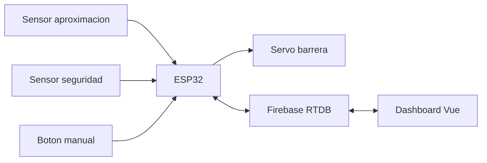

# Diagrama De Conexiones Nuevo (ESP32 + 2 Sensores + Barrera)

Este diagrama aplica al controlador IoT fisico del porton en arquitectura de un solo lado.

## 1) Logica fisica

- Sensor 1 (aproximacion): detecta llegada de camion.
- Sensor 2 (seguridad): evita cierre con obstaculo bajo barrera.
- Servo: abre/cierra barrera.
- Boton: control fisico cuando modo `manual_fisico`.



## 2) Pinout recomendado (ESP32 DevKit)

| Modulo | Senal | Pin ESP32 |
|---|---|---|
| HC-SR04 Aproximacion | TRIG | GPIO23 |
| HC-SR04 Aproximacion | ECHO | GPIO22 |
| HC-SR04 Seguridad | TRIG | GPIO21 |
| HC-SR04 Seguridad | ECHO | GPIO19 |
| Servo SG90 | PWM/SIG | GPIO18 |
| Boton manual | IN (pull-up interno) | GPIO5 |

## 3) Alimentacion

- ESP32: 5V por USB o pin 5V (segun tu placa).
- Servo: fuente 5V externa dedicada (recomendado >= 2A).
- HC-SR04: 5V.
- GND comun obligatorio entre ESP32, sensores y fuente de servo.

## 4) Conexion electrica resumida

```text
5V PSU --------------+-------------------+-------------------+
                     |                   |                   |
                  [Servo VCC]        [HC-SR04 #1 VCC]   [HC-SR04 #2 VCC]

GND PSU --------------+-------------------+-------------------+----- ESP32 GND
                      |                   |
                  [Servo GND]        [HC-SR04 GNDs]

ESP32 GPIO18 ------------------------------------------ Servo SIG
ESP32 GPIO23 ------------------------------------------ HC-SR04 #1 TRIG
ESP32 GPIO22 <----------------------------------------- HC-SR04 #1 ECHO (via divisor)
ESP32 GPIO21 ------------------------------------------ HC-SR04 #2 TRIG
ESP32 GPIO19 <----------------------------------------- HC-SR04 #2 ECHO (via divisor)

ESP32 GPIO5 ----[INPUT_PULLUP]---- Boton ---- GND
```

## 5) Advertencia importante de voltajes

La salida `ECHO` de HC-SR04 es 5V. ESP32 usa 3.3V en GPIO.

Usa divisor resistivo por cada `ECHO` (ejemplo 1k + 2k) o level shifter:
- ECHO -> R1 (1k) -> Nodo -> GPIO ESP32
- Nodo -> R2 (2k) -> GND

## 6) Recomendacion industrial (cuando pases de prototipo a campo)

- Reemplazar HC-SR04 por radar FMCW y sensor ToF/LiDAR industrial.
- Mantener la misma interfaz logica en firmware: `presenceDetected` y `safetyBlocked`.
