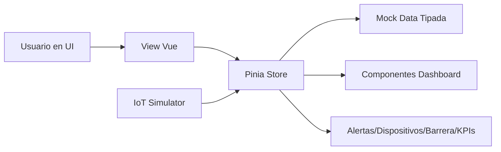

# Stack y Flujo del Dashboard (MVP)

Este documento resume el stack tecnico y el flujo operativo actual del frontend del dashboard.

## 1) Stack del proyecto

### Core
- `Vue 3` (Composition API)
- `TypeScript`
- `Vite`

### Estado y navegacion
- `Pinia` para manejo de estado global
- `Vue Router` para rutas y guardas por rol

### UI y visualizacion
- `Tailwind CSS`
- `@heroicons/vue`
- `Chart.js` + `vue-chartjs`

### Scripts principales
En `dashboard/package.json`:
- `npm run dev` -> levanta entorno local
- `npm run build` -> type-check + build produccion
- `npm run preview` -> preview del build

## 2) Arquitectura frontend (alto nivel)

```text
LoginView
  -> Router guard (auth + roles)
  -> MainLayout (Header + Sidebar + RouterView)
  -> Views (Dashboard, History, Reports, Alerts, Vehicles, Settings, Users)
  -> Components por modulo
  -> Stores Pinia (mocks tipados)
```

## 3) Rutas y control de acceso

- Publica:
  - `/login`
- Autenticadas:
  - `/` (Dashboard)
  - `/history`
  - `/reports`
  - `/alerts`
  - `/vehicles`
- Solo admin:
  - `/settings`
  - `/users`

Roles:
- `admin`: acceso total
- `supervisor`: acceso operativo y control de barrera

## 4) Stores principales

- `auth.store.ts`: sesion, rol actual, permisos (`canControlBarrier`)
- `dashboard.store.ts`: KPIs, estado planta, actividad, graficos, refresh simulado
- `vehicles.store.ts`: listado y operaciones de vehiculos
- `history.store.ts`: filtros y registros de acceso
- `reports.store.ts`: resumenes y series para reportes
- `alerts.store.ts`: alertas, filtros, resolver/ignorar/crear
- `devices.store.ts`: estado de dispositivos (online/offline/degradado)
- `barrier.store.ts`: modo/estado de barrera y bitacora de comandos
- `settings.store.ts`: configuracion operativa
- `users.store.ts`: usuarios, roles, estado y auditoria
- `iot-simulator.store.ts`: generador de eventos IoT coordinados

## 5) Flujo funcional del Dashboard

## 5.1 Inicio de sesion
1. Usuario entra a `/login`.
2. `auth.store` valida email demo y crea sesion local.
3. Router redirige a `/`.
4. Guard global aplica restricciones por rol en cada ruta.

## 5.2 Carga inicial del dashboard
1. `DashboardView` monta layout y widgets.
2. Se leen datos desde stores (mock tipado).
3. Se muestra estado de carga inicial.
4. Se renderizan:
   - KPIs
   - semaforo de ocupacion
   - grafico por hora
   - camiones en planta
   - alertas activas
   - estado de dispositivos
   - control de barrera
   - actividad reciente

## 5.3 Actualizacion periodica
1. Timer en `DashboardView` dispara `dashboardStore.refreshSnapshot()`.
2. El store simula entradas/salidas y recalcula:
   - `trucksInPlant`
   - ocupacion y nivel (`bajo/medio/alto`)
   - promedio de permanencia
   - series de actividad
3. Se actualiza `lastUpdated`.
4. Si hay falla simulada, se informa en `ErrorState` con opcion de reintento.

## 5.4 Modo demo IoT (sin backend real)
1. `iot-simulator.store` puede correr automatico o manual.
2. Cada ciclo ejecuta un escenario:
   - dispositivo offline
   - dispositivo recuperado
   - dispositivo degradado
   - ciclo automatico de barrera
   - patente no autorizada
3. El escenario impacta stores en conjunto:
   - `devices.store` cambia estados
   - `alerts.store` crea/resuelve alertas
   - `barrier.store` actualiza modo/estado y bitacora
   - `dashboard.store` agrega actividad reciente

## 6) Flujo de datos entre capas (resumen)



## 7) Estado actual del MVP

- Frontend modular operativo con datos simulados.
- Permisos por rol aplicados en rutas.
- Dashboard con widgets requeridos y refresh simulado.
- Vistas clave implementadas (`history`, `reports`, `alerts`, `vehicles`, `settings`, `users`).
- Estructura lista para migrar a integracion real (ej. Firebase) desde capa store.
